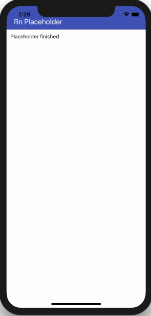

# Paragraph

<p align="center">
  
</p>

### Usage

```jsx
<Placeholder.Paragraph
  lineNumber={3}
  textSize={16}
  lineSpacing={5}
  color="#ff0000"
  width="100%"
  lastLineWidth="70%"
  firstLineWidth="50%"
  onReady={this.state.isReady}
>
  <Text>Placeholder finished</Text>
</Placeholder.Paragraph>
```

### API

| Props            | Type     | Default value   | Description                             |
| ---------------- | -------- | --------------- | --------------------------------------- |
| `lineNumber`     | `Number` | mandatory props | Number of line to display               |
| `textSize`       | `Number` | `12`            | Text size of the line                   |
| `lineSpacing`    | `Number` | `12`            | The space between each lines            |
| `color`          | `String` | `#efefef`       | The color of the lines                  |
| `width`          | `String` | `100%`          | The lines width in percentage           |
| `lastLineWidth`  | `String` | `100%`          | The last line width for visual effects  |
| `firstLineWidth` | `String` | `100%`          | The first line width for visual effects |
