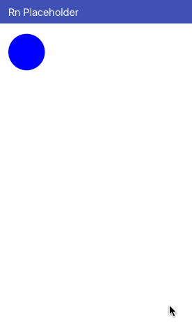

# Media

<p align="center">
  
</p>

### Usage

```jsx
<Placeholder.Media
  color="#0000ff"
  size={70}
  hasRadius
  onReady={this.state.isReady}
>
  <Text>Placeholder finished</Text>
</Placeholder.Media>
```

### API

| Props       | Type      | Default value | Description              |
| ----------- | --------- | ------------- | ------------------------ |
| `size`      | `Number`  | `40`          | Text media shape size    |
| `hasRadius` | `Boolean` | `false`       | Do the shape have radius |
| `color`     | `String`  | `#efefef`     | The media shape color    |
