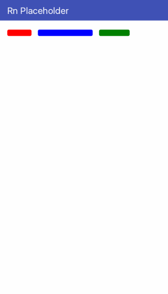

# MultiWords

<p align="center">
  
</p>

### Usage

```javascript
/* ... */
render() {
  const words = [
    { color: 'red', width: '20%' },
    { color: 'blue', width: '40%' },
    { color: 'green', width: '20%' }
  ];
  return (
    <Placeholder.MultiWords
      words={words}
      textSize={14}
      onReady={this.state.isReady}
    >
      <Text>Placeholder finished</Text>
    </Placeholder.MultiWords>
  )
}
```

### API

| Props      | Type          | Default value | Description                 |
| ---------- | ------------- | ------------- | --------------------------- |
| `words`    | `Array<Word>` | `[]`          | An array of word definition |
| `textSize` | `Number`      | `12`          | Text size of the line       |

**Word**

```javascript
const word = { color: "red", width: "30%" };
```
