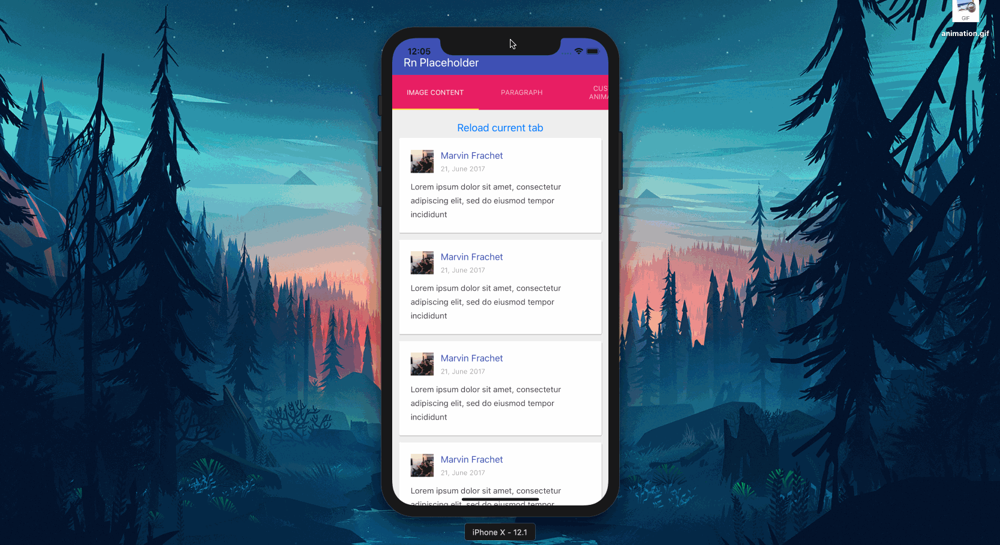

# Animations

<p align="center">

</p>

## Default animations

There are two built-in animations inside this library `shine` and `fade`. They can be used by passing them inside the `animation` prop:

```javascript
<Placeholder
  animation="fade"
  isReady={isReady}
  whenReadyRender={ComponentLoaded}
>
  <Line width="70%" />
  <Line />
  <Line />
  <Line width="30%" />
</Placeholder>
```

## Custom animations

It's also possible to create custom animations using the `customAnimation` props of the `Placeholder` component:

```javascript
<Placeholder
  customAnimation={ColorAnimation}
  isReady={isReady}
  whenReadyRender={ComponentLoaded}
>
  <Line width="70%" />
  <Line />
  <Line />
  <Line width="30%" />
</Placeholder>
```

The `ColorAnimation` can be defined this way:

```javascript
import React from "react";
import { Animated } from "react-native";

export const ColorAnimation = ({ children, style = {} }) => {
  const animation = new Animated.Value(0);

  function start() {
    return Animated.timing(animation, {
      toValue: 100,
      duration: 1500
    }).start(e => {
      if (e.finished) {
        start();
      }
    });
  }

  start();

  const backgroundColor = animation.interpolate({
    inputRange: [0, 50, 100],
    outputRange: ["yellow", "orange", "blue"]
  });

  const newStyle = { ...style, backgroundColor, padding: 20 };

  return <Animated.View style={newStyle}>{children}</Animated.View>;
};
```

_Note: when building a custom animation, make sure to pass the style props to the `Animated.View`_
