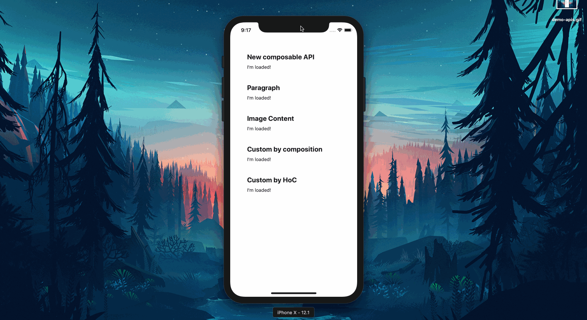

# Components

<p align="center">

</p>

## Content

- [Composable API](#composable-api)
- [Paragraph](#paragraph)
- [ImageContent](#imagecontent)
- [Custom component](#custom-component)
  - [By composing](#by-composing)
  - [Using an HoC](#using-an-hoc)

### Composable API

```javascript
import Placeholder, { Line, Media } from "rn-placeholder";

export const Compo = () => {
  const [isReady, setReady] = useState(false);

  // your logic

  return (
    <Placeholder
      animation="fade"
      isReady={isReady}
      whenReadyRender={() => <ComponentLoaded />}
      renderLeft={() => <Media style={{ backgroundColor: "green" }} />}
      renderRight={() => <Media hasRadius />}
    >
      <Line width="70%" />
      <Line style={{ backgroundColor: "blue", width: "22%" }} />
      <Line />
      <Line width="30%" />
    </Placeholder>
  );
};
```

### Paragraph

```javascript
import { Paragraph } from "rn-placeholder";

export const Compo = () => {
  const [isReady, setReady] = useState(false);

  // your logic

  return (
    <Paragraph
      animation="fade"
      lineNumber={3}
      textSize={16}
      lineSpacing={5}
      color="#ff0000"
      width="100%"
      lastLineWidth="70%"
      firstLineWidth="50%"
      isReady={isReady}
    >
      <ComponentLoaded />
    </Paragraph>
  );
};
```

### ImageContent

```javascript
import { ImageContent } from "rn-placeholder";

export const Compo = () => {
  const [isReady, setReady] = useState(false);

  // your logic

  return (
    <ImageContent
      animation="fade"
      position="left"
      hasRadius
      lineNumber={5}
      textSize={14}
      lineSpacing={5}
      color="#00ff00"
      width="100%"
      lastLineWidth="30%"
      firstLineWidth="10%"
      isReady={isReady}
    >
      <ComponentLoaded />
    </ImageContent>
  );
};
```

### Custom component

#### By composing

```javascript
<Placeholder
  animation="fade"
  isReady={isReady}
  whenReadyRender={() => <ComponentLoaded />}
  renderLeft={() => <LeftComponent />}
  renderRight={() => <RightComponent />}
>
  <Text>Hello world</Text>
</Placeholder>
```

#### Using an HoC

```javascript
import { connect } from "rn-placeholder";

const TextHoc = connect(() => <Text>Hello world</Text>);

export const Compo = () => {
  const [isReady, setReady] = useState(false);

  // your logic

  return (
    <TextHoc
      animation="fade"
      isReady={isReady}
      whenReadyRender={() => <ComponentLoaded />}
    />
  );
};
```
